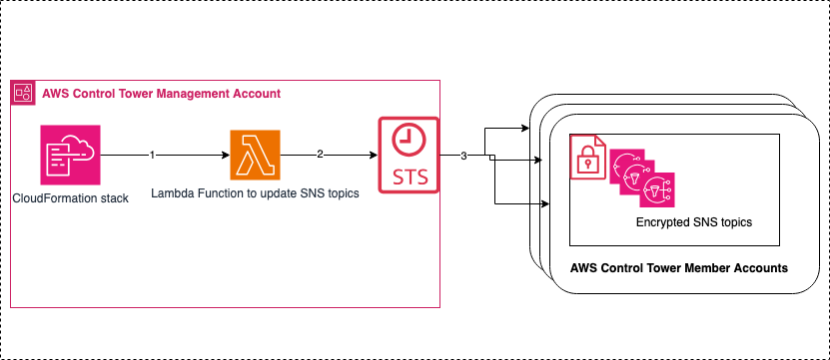

# Encrypt AWS Control Tower SNS Topics with Customer-Managed Keys

## Overview

AWS Control Tower is a service that simplifies the setup and governance of a secure, multi-account AWS environment. As part of its security features, AWS Control Tower creates an Amazon Simple Notification Service (Amazon SNS) topic named 'aws-controltower-SecurityNotifications' in each enrolled AWS Account to handle security-related notifications. These notification topics are encrypted by default using disk encryption. However, organizations with stringent security requirements need to optimize encryption using Customer Managed Keys (CMK) to leverage their own keys.

## The Solution

This solution provides an automated, scalable approach to implementing KMS Customer Managed Key (CMK) encryption for Amazon SNS topics that are created and managed by AWS Control Tower.

The following diagram shows how the solution is deployed and works. It deploys a AWS CloudFormation stack in the AWS Control Tower management account, which creates a custom AWS Lambda function as a resource. This Lambda function assumes the AWSControlTowerExecution role to update the SNS topics with a provided custom KMS key in the AWS member accounts.



## Prerequisites

Before deployment, ensure you have:
- AWS Control Tower version 3.3 or later fully configured
- Customer-Managed Keys (CMK) created in target regions and accounts
- Administrative access to the AWS Control Tower management account
- Accounts enrolled in Control Tower (present in AWSControlTowerBP-BASELINE-CLOUDWATCH StackSet)
- AWS CLI configured (if deploying via CLI)

## Quick Start

### Option 1: Console Deployment
1. Log in to the AWS Control Tower management account
2. Navigate to CloudFormation in your Control Tower home region
3. Select "Create stack" and upload the template
4. Fill in required parameters
5. Review and create the stack

### Option 2: CLI Deployment
```bash
aws cloudformation create-stack \
  --stack-name sns-kms-encryption \
  --template-body file://template.yaml \
  --parameters ParameterKey=KMSKeyId,ParameterValue="arn:aws:kms:region1:account1:key/key-id1,arn:aws:kms:region2:account2:key/key-id2" \
  --capabilities CAPABILITY_IAM
